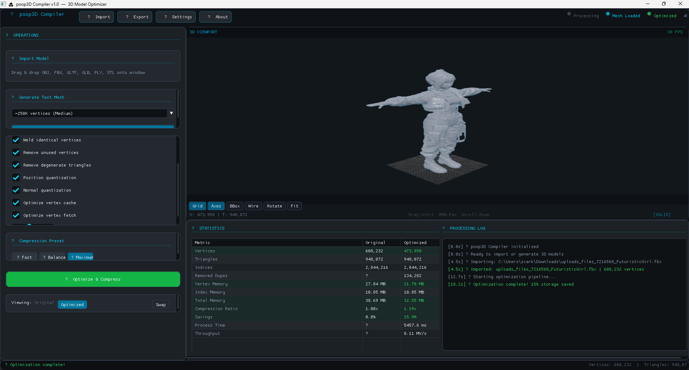

# 💩 poop3D Compiler
### Professional 3D Model Optimizer & Compressor

> Engineered & Developed by **Hardik**  
> Produced & Maintained by **poop Organization, India 🇮🇳**

A production-quality desktop application for optimizing and compressing 3D models. Built with C++20, Dear ImGui, OpenGL3, GLFW, and Assimp.

---

## ✨ Features

- **Real optimization algorithms** — duplicate removal, vertex welding, cache optimization, fetch optimization, quantization
- **Live 3D viewport** — orbit/pan/zoom, wireframe, grid, axes, bounding box, FPS counter
- **Procedural mesh generation** — generate 50K / 250K / 1M vertex test meshes instantly
- **File import** — OBJ, FBX, GLTF, GLB, PLY, STL (via Assimp)
- **Drag & drop** — drop any 3D file onto the window
- **Premium dark theme** — neon cyan highlights, animated widgets, success banners
- **Analytics panel** — live compression stats, processing log, throughput metrics
- **Export** — save optimized mesh as OBJ
- **Fully offline** — no cloud, no tracking, no subscriptions

---



## 🚀 Quick Start

### Step 1 — Get dependencies
```bash
# Linux/macOS: Install system libraries first
# Ubuntu/Debian:
sudo apt-get install -y libglfw3-dev libassimp-dev libgl1-mesa-dev \
    libx11-dev cmake build-essential

# Arch Linux:
sudo pacman -S glfw assimp mesa cmake gcc

# macOS (Homebrew):
brew install glfw assimp cmake

# Then download ImGui + GLAD:
python3 fetch_deps.py
```

### Step 2 — Build
```bash
chmod +x build.sh
./build.sh
```

### Step 3 — Run
```bash
./run.sh
# or directly:
./build/bin/poop3D
```

---

## 🪟 Windows Instructions

### Requirements
- [Visual Studio 2022](https://visualstudio.microsoft.com/) (Community is free) with "Desktop development with C++" workload
- [CMake 3.20+](https://cmake.org/download/) — check "Add to PATH"
- [Git for Windows](https://git-scm.com/)

### Steps
```batch
REM 1. Download ImGui and GLAD
python fetch_deps.py

REM 2. Setup vcpkg (installs GLFW and Assimp)
setup_windows.bat

REM 3. Build
build_windows.bat

REM 4. Run
build_win\bin\Release\poop3D.exe
```

---

## 🎮 Controls

| Input | Action |
|-------|--------|
| Left drag | Orbit camera |
| Right drag | Pan camera |
| Scroll wheel | Zoom in/out |
| `W` | Toggle wireframe |
| `G` | Toggle grid |
| `R` | Toggle auto-rotate |
| `F` | Fit model to view |
| Drag & drop | Import 3D file |

---

## 🏗 Project Structure

```
poop3D/
├── CMakeLists.txt          # Build system
├── fetch_deps.py           # Download ImGui + GLAD (run first!)
├── build.sh                # Linux/macOS build
├── build_windows.bat       # Windows build
├── setup.sh                # Linux/macOS full setup
├── setup_windows.bat       # Windows vcpkg setup
├── run.sh                  # Launch script
└── src/
    ├── main.cpp            # Entry point, GLFW window, main loop
    ├── app.h / app.cpp     # Main application class, all UI panels
    ├── renderer.h / .cpp   # OpenGL 3.3 renderer, shaders, FBO
    ├── mesh_optimizer.h/cpp# Optimization pipeline (all algorithms)
    ├── ui_theme.h / .cpp   # ImGui theming, custom widgets, animations
    ├── types.h             # All shared data types
    ├── windows_main.cpp    # WinMain wrapper for Windows
    ├── glad/               # OpenGL loader (auto-populated by fetch_deps.py)
    │   ├── glad.h
    │   ├── glad.c
    │   └── KHR/
    │       └── khrplatform.h
    └── imgui/              # Dear ImGui (auto-populated by fetch_deps.py)
        ├── imgui.h
        ├── imgui.cpp
        ├── imgui_draw.cpp
        ├── imgui_tables.cpp
        ├── imgui_widgets.cpp
        └── backends/
            ├── imgui_impl_glfw.h/cpp
            └── imgui_impl_opengl3.h/cpp
```

---

## 🔧 Optimization Pipeline

| Pass | Description |
|------|-------------|
| Remove degenerate triangles | Eliminates zero-area faces |
| Generate index buffer | Creates indexed geometry for GPU |
| Remove duplicate vertices | Hash-map based exact deduplication |
| Weld identical vertices | Spatial threshold-based merging |
| Remove unused vertices | Purge vertices not in any triangle |
| Position quantization | Reduces float precision (saves ~30%) |
| Normal quantization | Snaps normals to 8-bit grid |
| Vertex cache optimization | Reorders tris for GPU L0 cache |
| Vertex fetch optimization | Linear memory access pattern |

---

## 📦 Technology Stack

| Library | Purpose | License |
|---------|---------|---------|
| C++20 | Core language | — |
| [Dear ImGui v1.90.5](https://github.com/ocornut/imgui) | UI framework | MIT |
| [GLFW 3.3+](https://www.glfw.org/) | Window & input | Zlib |
| OpenGL 3.3 Core | GPU rendering | — |
| GLAD | OpenGL loader | MIT |
| [Assimp](https://github.com/assimp/assimp) | 3D file import | BSD |

All libraries are free and open-source. No proprietary dependencies.

---

## 🎨 Theme

| Color | Usage |
|-------|-------|
| `#00D9FF` Neon Cyan | Highlights, active elements, branding |
| `#33D966` Green | Success states, optimized stats |
| `#FF8C1A` Orange | Warnings, processing states |
| `#F24040` Red | Errors, cancel |
| `#161A1E` Charcoal | Main background |
| `#1C2130` Panel | Panel backgrounds |

---

## 🐞 Troubleshooting

**"GLFW not found"**
```bash
# Ubuntu
sudo apt-get install libglfw3-dev

# macOS
brew install glfw
```

**"Assimp not found"** — App will still work! File import will be limited to OBJ only. Install assimp for full format support.

**"OpenGL 3.3 not supported"** — Update your GPU drivers. Intel HD 4000+, GTX 400+, or any AMD GCN card supports OpenGL 3.3.

**Black viewport on macOS** — This is a known GLFW/macOS issue on some machines. Run `./build.sh Debug` for verbose output.

---

## 📄 License

© 2026 Hardik / poop Organization

---

*Built to provide free, fast, privacy-friendly tools for 3D optimization without unnecessary complexity.*
